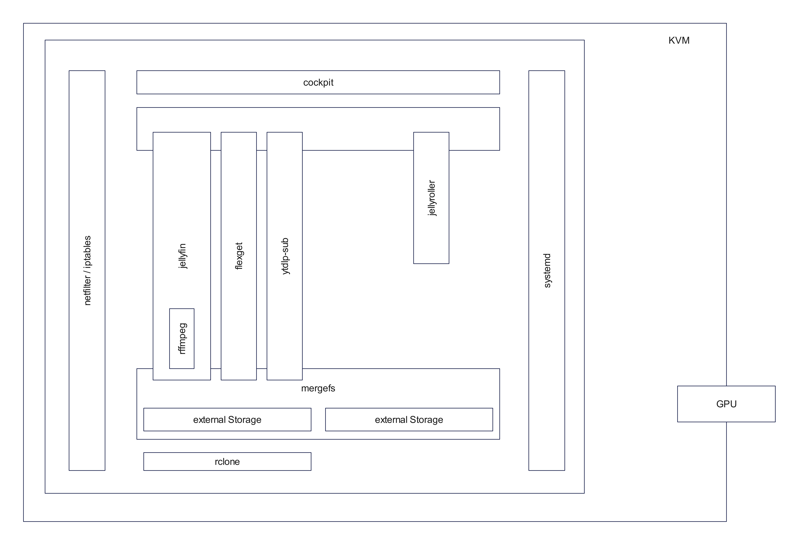

# Mediaserver

This collection of files will create a fresh Fedora-based vm which will
represent a fully stacked media-server. It is easy to deploy and follows
all techniques used in the [boxes repo](https://github.com/g4s/boxes).

## Features
  - a nice and clean vm
    - all services are deployed as container with podman
      - jellyfin as the main and integral media component
      - a virtual DVR based on
        - flexget
        - ytdlp-sub
        - various custom scripts
      - jellyroller for jellyfin CLI management
    - a unified mediastorage
      - which also included user-home auto import
      - external storage (hetzner storage box)
    - a system management dashboard with cockpit
    - automatic deploy to tailscale

## Architecture

## Service-Deployment
It is highly recommendet to use the provided pypyr-pipeline for deployment. This pipeline will gather all necessary information for an KVM deployment. Also it's strongly recommendet to execute this pipeline (and the corresponding packer hcl-template) directly on your hypervisor.

pypyr will split the deployment in three stages:

  1. ensure all necessary build and provision scripts are on your local host

  2. building a fresh vm

       - based on Fedora
       - provision the machine
       - copy additional buildscript inside the machine
       - (optional) join tailscale overlay

  3. creating the service container inside the vm and tucking all together.

At the end you will have amostly configured usable media-system. (Unfortunately
not all jellyfin settings can be provisioned.)

It's absolutey possible to customize every step and inject your own code in
in this project. For this you should study all code files and edit them for
your needs.